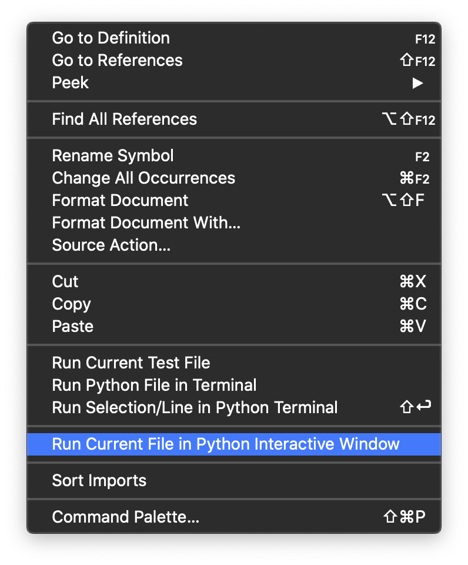
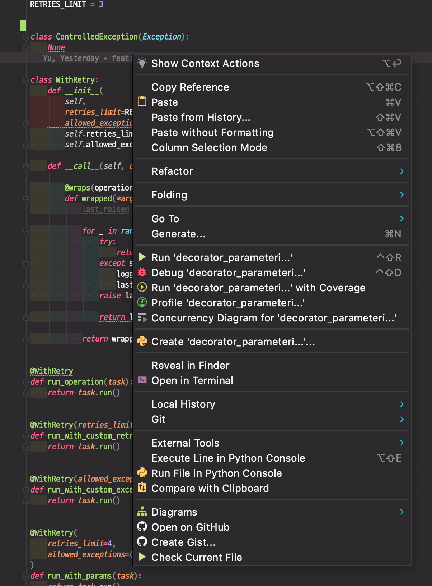

# Clean code in Python (1st try)

이 repo는 파이썬 클린코드 의 코드를 따라치면서 모르는걸 주석으로 기록한 파일을 모아놨다.

상세한 내용은 블로그로 정리된 후 포스팅 될 예정이다.

디렉토리 구조는 아래와 같다:

+ chapter<number>_<주요 키워드>
  + cf
    + 그때당시 모르는 개념들에 대해 기술
    + 오개념일 수도 있는 것들은 2회차, 3회차 가서 다시 되짚거나 보강할 예정.
  + files..

책에서 소개하는 소스코드 원문은 [해당 링크](https://github.com/PacktPublishing/Clean-Code-in-Python)를 참조.

## 스터디 방법

+ 책에서 제시하는 방향을 이해하려고 최대한 애쓴다.
+ 소스코드는 무조건 한번 손으로 친다. 그다음 실행시킨다. 모르거나 이해안되는건 디버그를 하든 해서 알아먹으려 한다.
  + 온라인 스터디(오프라인도)때는 Live share 같은걸로 켜서 같이 코드를 보고 읽는다.
  + 디버그는 Visual Studio Code의 디버그를 수행해서 돌린다.
    - [ ] Watch나 콜스택 보는 기능 찾기
+ Visual Studio Code, PyCharm 모두 디버그가 되니 손에 익은걸로 한다.

## interactive shell로 디버그 하려면?

### Visual Studio Code에선?

소스코드에서 우클릭을 한다.

### PyCharm에선? (v2020.01)

소스코드에서 우클릭을 한다.

